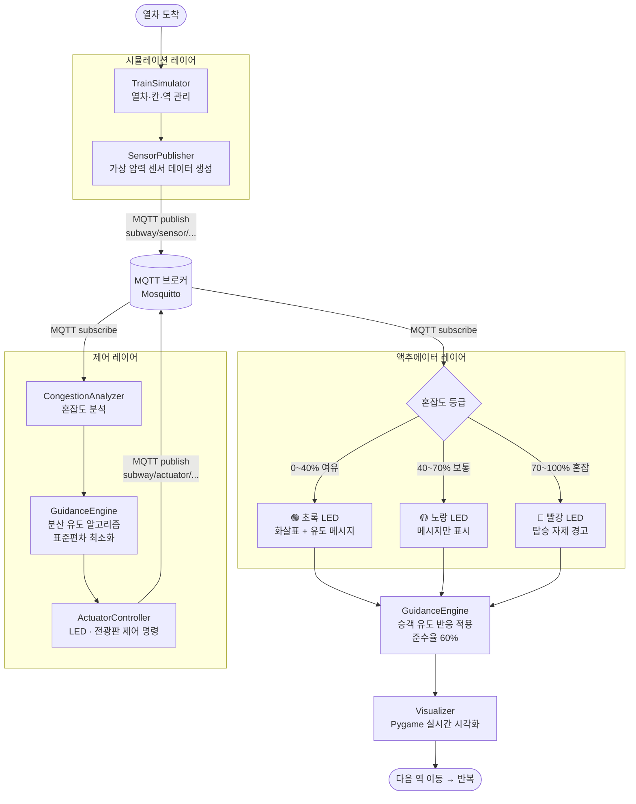
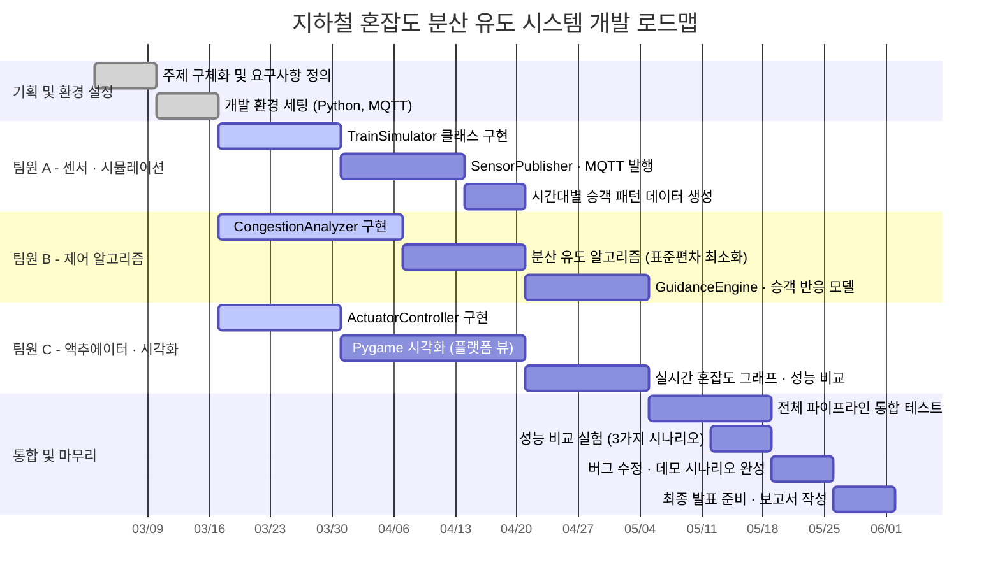

# 지하철 혼잡도 기반 실시간 승객 분산 유도 시스템

> IoT 액추에이터를 활용한 조별 프로젝트 계획서

---

## 1. 프로젝트 개요

각 칸의 가상 압력 센서로 혼잡도를 실시간 측정하고, 플랫폼의 LED 안내 액추에이터와 전광판을 제어해 승객을 덜 붐비는 칸으로 유도하여 전체 혼잡 편차를 최소화하는 IoT 시스템.

| 항목 | 내용 |
|---|---|
| 팀 구성 | 3명 |
| 개발 기간 | 15주 (한 학기) |
| 시뮬레이션 환경 | Python + MQTT + Pygame |
| 핵심 기술 | MQTT 통신, 혼잡도 분산 알고리즘, 실시간 시각화 |

---

## 2. 문제 정의

출퇴근 시간대 특정 칸에 승객이 집중되는 현상은 안전사고 위험과 불쾌한 탑승 경험을 유발한다. 현재 안내 방식은 정적 표지판 수준으로, 실시간 혼잡도에 반응하지 못한다.

**목표**: 실시간 혼잡도 데이터를 기반으로 액추에이터를 제어하여 전체 칸의 혼잡도 표준편차를 최소화한다.

---

## 3. 시나리오 정의

### 시뮬레이션 범위

- 지하철 1개 노선, 3개 역 (A역 → B역 → C역)
- 열차 1편성: 8칸 구성
- 플랫폼에 대기 승객이 줄서있다가 열차 도착 시 탑승

### 동작 흐름

```
열차 도착
    ↓
각 칸 압력 센서 → 혼잡도 측정 (0~100%)
    ↓
MQTT 브로커로 데이터 전송
    ↓
혼잡도 분석 서버 → 분산 알고리즘 실행
    ↓
플랫폼 LED 액추에이터 제어
(혼잡 칸: 빨강 / 여유 칸: 초록 + 화살표)
    ↓
승객 이동 시뮬레이션 (유도 효과 반영)
    ↓
다음 역 이동 → 반복
```

---

## 4. 시스템 구조

```
[가상 압력 센서 (SensorPublisher)]
        ↓ MQTT publish
   [MQTT 브로커 (Mosquitto)]
        ↓ MQTT subscribe
[혼잡도 분석 서버 (CongestionAnalyzer)]
        ↓
  [분산 유도 알고리즘 (GuidanceEngine)]
        ↓
[액추에이터 제어 (ActuatorController)]
  LED 신호등 / 전광판 메시지
        ↓
   [Pygame 실시간 시각화 (Visualizer)]
```

---

## 5. 데이터 구조

### 센서 데이터 (MQTT publish)

```json
{
  "timestamp": "2024-01-01T08:30:00",
  "station": "A",
  "train_id": "T001",
  "car_id": 3,
  "occupancy": 72,
  "capacity": 160,
  "congestion_rate": 0.45
}
```

### 액추에이터 제어 명령 (MQTT subscribe)

```json
{
  "timestamp": "2024-01-01T08:30:01",
  "station": "A",
  "car_id": 3,
  "led_color": "green",
  "arrow": true,
  "display_msg": "여유 — 이쪽으로 이동하세요"
}
```

---

## 6. 혼잡도 분류 기준

| 혼잡도 | 등급 | LED 색상 | 액추에이터 동작 |
|---|---|---|---|
| 0 ~ 40% | 여유 | 초록 | 화살표 표시 + 유도 메시지 |
| 40 ~ 70% | 보통 | 노랑 | 메시지만 표시 |
| 70 ~ 100% | 혼잡 | 빨강 | 탑승 자제 경고 |
| 100% 초과 | 만원 | 빨강 점멸 | 강제 차단 신호 |

---

## 7. 핵심 알고리즘

### 분산 알고리즘 (표준편차 최소화)

```python
def recommend_cars(congestion_rates: list[float]) -> list[int]:
    """
    혼잡도 리스트를 받아 이동을 권장할 칸 번호 반환
    목표: 전체 칸의 혼잡도 표준편차를 최소화
    """
    avg = sum(congestion_rates) / len(congestion_rates)

    # 평균의 80% 미만인 칸만 추천
    recommended = [
        i + 1 for i, rate in enumerate(congestion_rates)
        if rate < avg * 0.8
    ]
    return recommended


def evaluate_distribution(congestion_rates: list[float]) -> float:
    """혼잡도 표준편차 계산 — 낮을수록 잘 분산된 상태"""
    avg = sum(congestion_rates) / len(congestion_rates)
    variance = sum((r - avg) ** 2 for r in congestion_rates) / len(congestion_rates)
    return variance ** 0.5
```

### 승객 유도 반응 모델

```python
# 액추에이터 작동 후 승객이 실제로 이동하는 비율
# 현실적으로 100% 따르지 않음 — 유도 효과에 노이즈 적용
def apply_guidance_effect(waiting_passengers, recommended_cars):
    compliance_rate = 0.6   # 60%의 승객만 유도에 따름
    random_rate = 0.2       # 20%는 완전 랜덤 이동
    # 나머지 20%는 원래 의도대로 이동
```

---

## 8. MQTT 토픽 구조

```
subway/
├── sensor/
│   └── {station}/{train_id}/{car_id}    # 센서 데이터 발행
├── actuator/
│   └── {station}/{car_id}/led           # LED 제어 명령
│   └── {station}/{car_id}/display       # 전광판 메시지
└── system/
    └── status                           # 시스템 상태 모니터링
```

---

## 9. 클래스 설계

```
TrainSimulator          # 열차 이동, 칸별 승객 관리
    ├── Car             # 개별 칸 (혼잡도, 정원, 승객 수)
    └── Station         # 역 (대기 승객, 플랫폼 상태)

SensorPublisher         # 가상 센서 데이터 생성 + MQTT 발행
CongestionAnalyzer      # 혼잡도 수신 + 분산 알고리즘 실행
ActuatorController      # LED/전광판 제어 명령 발행
GuidanceEngine          # 승객 유도 반응 시뮬레이션
Visualizer              # Pygame 실시간 시각화
```

---

## 10. Pygame 화면 구성

```
┌─────────────────────────────────────────────────┐
│  지하철 혼잡도 분산 유도 시스템                      │
│  현재 역: B역  /  시간: 08:32                      │
├─────────────────────────────────────────────────┤
│  [플랫폼 뷰]                                       │
│  ┌──┬──┬──┬──┬──┬──┬──┬──┐  ← 열차 8칸          │
│  │🔴│🔴│🟡│🟢│🟢│🟡│🔴│🔴│  ← 칸별 LED          │
│  │85│78│55│32│28│60│82│79│  ← 혼잡도(%)          │
│  └──┴──┴──┴──┴──┴──┴──┴──┘                      │
│       ↑↑↑↑  이쪽으로  ↑↑↑↑   ← 유도 화살표        │
│  대기 승객: ●●●●●●●●●●●● (120명)                 │
├─────────────────────────────────────────────────┤
│  [실시간 혼잡도 그래프]      [표준편차 추이]          │
│  유도 전: σ = 18.4          유도 후: σ = 6.2       │
└─────────────────────────────────────────────────┘
```

---

## 11. 역할 분담

| 팀원 | 담당 모듈 | 주요 작업 |
|---|---|---|
| A | SensorPublisher, TrainSimulator | 열차/칸/역 클래스, 시간대별 승객 패턴 생성, MQTT 발행 |
| B | CongestionAnalyzer, GuidanceEngine | 혼잡도 분석, 분산 알고리즘, 승객 유도 반응 모델 |
| C | ActuatorController, Visualizer | LED/전광판 제어 명령, Pygame 시각화, 성능 비교 그래프 |

---

## 12. 개발 일정 (15주)

| 기간 | 내용 |
|---|---|
| 1 ~ 2주 | 주제 구체화, 요구사항 정의, 툴 환경 세팅 |
| 3 ~ 4주 | 가상 센서 데이터 생성기 구현, MQTT 통신 구축 |
| 5 ~ 7주 | 혼잡도 분석 서버 + 분산 알고리즘 구현 |
| 8 ~ 10주 | 액추에이터 제어 로직 + Pygame 시각화 연동 |
| 11 ~ 12주 | 통합 테스트, 알고리즘 성능 비교 실험 |
| 13 ~ 14주 | 버그 수정, 데모 시나리오 완성 |
| 15주 | 최종 발표 준비 및 보고서 작성 |

---

## 13. 성능 비교 실험 계획

데모에서 알고리즘 효과를 숫자로 보여주는 게 핵심이에요.

### 비교 시나리오 3가지

| 시나리오 | 설명 |
|---|---|
| 유도 없음 | 승객이 원하는 칸에 자유 탑승 |
| 단순 임계값 제어 | 혼잡도 70% 초과 시 빨간불만 켬 |
| 적응형 유도 (구현 알고리즘) | 표준편차 최소화 기반 실시간 유도 |

### 측정 지표

- 전체 칸 혼잡도 표준편차 (낮을수록 잘 분산)
- 최대 혼잡 칸 혼잡도 (낮을수록 좋음)
- 만원 칸 발생 횟수

---

## 14. 기대 결과물

- 실시간 혼잡도 히트맵이 나타나는 플랫폼 Pygame 시뮬레이션 화면
- 생존자 탐지 시 구역별 액추에이터가 단계적으로 작동하는 데모
- 유도 없음 vs 단순 제어 vs 적응형 유도 성능 비교 그래프
- MQTT 기반 센서-액추에이터 통신 로그

---

## 15. 기술 스택

| 분류 | 툴 |
|---|---|
| 시뮬레이션 | Python 3.x |
| MQTT 브로커 | Mosquitto |
| MQTT 클라이언트 | paho-mqtt |
| 시각화 | Pygame, Matplotlib |
| 데이터 처리 | NumPy |
| 버전 관리 | Git / GitHub |

---

## 16. 시스템 블록도



---

## 17. 개발 로드맵


